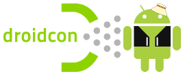

# Community Building for your Apps
Talk for Droidcon Romania 2018. Communities - they’re all around us, right? You may say, “Why do I need a community with my software project?” or “What good is hand-holding users of my app or company’s service?” or “Who drank all the LaCroix?” Regardless of your question or where you stand on communities, we’re going to jump right in to our elbows on the subject of communities, what they are, how to build them, and how to keep them.

## Speaker
Jeremy Meiss

## Viewing Presentation
[GitPitch](https://gitpitch.com/jerdog/talk-community-whatisit/droidconro18)

